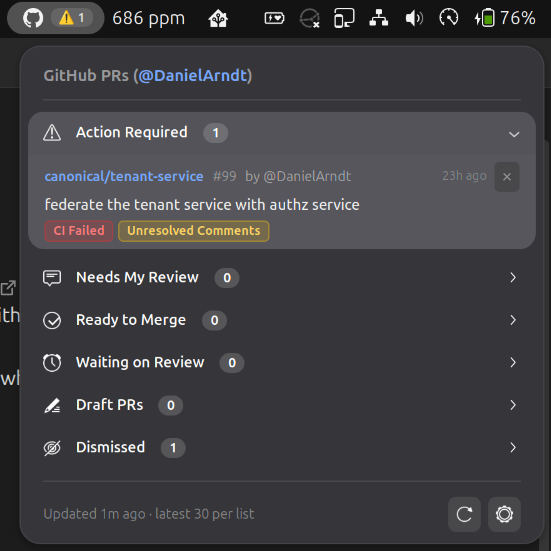

# GitHub PR Tracker (GNOME Shell Extension)

A GNOME Shell extension (compatible with GNOME Shell 45–50+) that tracks pull requests for
your GitHub account using the GitHub GraphQL API, organizing them into clear actionable
categories with precise status reason badges.

<p align="center">
  
</p>

---

## Features

- **Categorized PR Sections**:
  - ⚠️ **Action Required**: Pull requests authored by you (or assigned to you) that need your attention:
    - Reviewers requested changes (`CHANGES_REQUESTED`)
    - Failing required CI checks (checks required by branch protection, or failing checks that block merging when branch protection is not visible to you)
    - Merge conflicts with the target branch
    - Unresolved review comments/threads
  - 💬 **Needs My Review**: Pull requests from others (not assigned to you) where:
    - Review was requested directly from you (including author re-requests on previously reviewed PRs)
    - Review was requested from your team (when team review is enabled in preferences and you have not already reviewed it)
  - ✓ **Ready to Merge**: Approved pull requests authored by you (or assigned to you) with passing required CI checks and no conflicts.
  - ⏳ **Waiting on Review**: Open, non-draft pull requests authored by you (or assigned to you) that are awaiting review from others.
  - 📝 **Draft PRs**: Open draft pull requests authored by you (or assigned to you).
- **Informative PR Cards**:
  - Displays Repository (`owner/repo`), PR number (`#123`), Title, Author, and time elapsed.
  - Displays 1–2 word reason pills (e.g. `Changes Requested`, `CI Failed`, `Conflicts`, `Unresolved Comments`, `Assigned`) with support for multiple simultaneous reasons.
  - Clicking any pull request directly opens it in your default web browser.
- **GNOME Shell Design Compliant**:
  - Top bar panel indicator shows compact pill badges with symbolic status icons and counts, with palettes for both the dark and light GNOME Shell styles.
  - Automatically hides badges when counts are zero, displaying only the subtle GitHub icon.
- **Secure Credential Storage**:
  - GitHub Personal Access Tokens are stored securely in your system keyring using `libsecret` (Secret Service API), never in plain text configuration files.
- **Customizable Filtering**:
  - Include/exclude repositories using glob patterns (e.g. `canonical/*`, `owner/repo`).
  - Toggle ignoring archived repositories and repository forks.
  - Toggle including assigned pull requests (default: enabled).
  - Toggle including team review requests (default: disabled).
- **Configurable Polling**:
  - Background polling interval configurable between 1 and 60 minutes (default 5 minutes).
  - Manual refresh button in the menu footer.

### Limits

- Up to 30 of your most recently updated open pull requests, up to 30 pull requests awaiting your review, and up to 30 pull requests assigned to you,
  are fetched. When GitHub has more, the menu footer shows "latest 30 per list".
- Per pull request, up to 100 reviewers, reviews, review threads and status checks are considered.

---

## Installation

### Prerequisites
- GNOME Shell 45, 46, 47, 48, 49, or 50
- `gjs` (1.80+)
- `libsecret-1` (GNOME Keyring)
- `libsoup-3.0`

### Building & Installing

Clone the repository and run:

```bash
git clone https://github.com/DanielArndt/github-pr-tracker.git
cd github-pr-tracker
make install
```

This compiles GSettings schemas, packages the extension, installs it to `~/.local/share/gnome-shell/extensions/github-pr-tracker@dan.arndt.ca`, and compiles schemas in place.

After installing for the first time, log out and log back in so GNOME Shell picks up the new extension. GNOME Shell cannot be restarted in place on Wayland.

Then enable the extension:
```bash
gnome-extensions enable github-pr-tracker@dan.arndt.ca
```

---

## Setup & Configuration

1. Generate a GitHub Personal Access Token (classic):
   - Click **Generate Token** in the extension preferences (or go directly to
     [GitHub New Personal Access Token](https://github.com/settings/tokens/new?description=GitHub%20PR%20Tracker&scopes=repo))
     to pre-populate the token description and required `repo` scope.
   - **Public repositories only:** uncheck the `repo` scope if you do not track private repositories.
     A token with no scopes can read public data, which is all the extension needs.
   - **Private repositories:** keep the `repo` scope selected. GitHub has no read-only equivalent for classic tokens,
     so this scope also grants write access. The extension only reads data and never modifies anything,
     but treat the token accordingly and set an expiration date.
   - Fine-grained personal access tokens have not been tested and may not return all pull requests.
2. Open extension preferences:
   ```bash
   gnome-extensions prefs github-pr-tracker@dan.arndt.ca
   ```
   (Or click the gear icon in the extension's dropdown menu footer).
3. Paste your token into the **Personal Access Token** field and click **Save**.
4. Click **Test Connection** to verify that your account is detected and authenticated.

---

## Troubleshooting & Exporting Logs

If you encounter issues or need to attach diagnostic logs to a bug report:

1. **Via Extension Preferences**:
   - Open preferences (click the gear icon in the dropdown menu footer, or run `gnome-extensions prefs github-pr-tracker@dan.arndt.ca`).
   - Under the **Troubleshooting** group, click **Copy** to copy sanitized logs to your clipboard, or **Export…** to save them to a file (`github-pr-tracker.log`).
   - *Note:* All Personal Access Tokens, keys, and authorization headers are automatically redacted from exported logs.

2. **Via Command Line**:
   - Export journal logs to a file:
     ```bash
     journalctl --user -b -g "GitHub PR Tracker|github-pr-tracker" --no-pager > pr-tracker.log
     ```
   - Follow logs live while reproducing an issue:
     ```bash
     journalctl --user -f -g "GitHub PR Tracker|github-pr-tracker"
     ```
   - Or run `make logs` from this repository checkout.

---

## Development & Testing

To test in a nested session without logging out:

```bash
dbus-run-session gnome-shell --devkit             # GNOME 49 and later
dbus-run-session -- gnome-shell --nested --wayland # GNOME 45–48
```

Run unit tests covering classification, reason calculations, filtering, preferences, and log sanitization:

```bash
make test
```

View recent extension logs from the current session:

```bash
make logs
```

Clean build artifacts:

```bash
make clean
```

For guidelines on coding style, Conventional Commits, and GNOME Extension Best Practices, see [CONTRIBUTIONS.md](CONTRIBUTIONS.md).

---

## License

Copyright (C) 2026 Daniel Arndt

This program is free software: you can redistribute it and/or modify it under the terms of the
GNU General Public License as published by the Free Software Foundation, either version 2 of
the License, or (at your option) any later version. See [LICENSE](LICENSE) for the full text.
